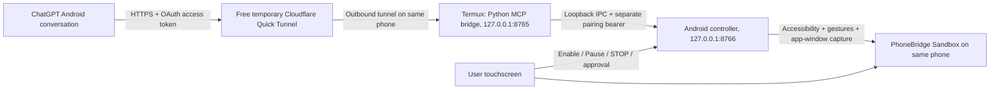

# Architecture and implementation boundaries

Everything except the ChatGPT service and HTTPS forwarding runs on the phone.
The relay never runs the controlled app or browser. The eventual browser stays
on the phone. The public tunnel is an access path, not an unguessable-secret
authentication mechanism. Only port 8765 is tunneled; never port 8766.

## Current OpenAI route

The [current plugin documentation](https://learn.chatgpt.com/docs/plugins) says
account-available plugins can be used in mobile Chat or Work. The [personal plugin
quickstart](https://developers.openai.com/plugins/quickstart) connects a custom MCP
server and creates a personal plugin. The [connection guide](https://developers.openai.com/plugins/deploy/connect-chatgpt)
supports public HTTPS/Streamable HTTP and OAuth. This is the target integration.

The [legacy developer-mode custom-app page](https://help.openai.com/en/articles/12584461-developer-mode-and-mcp-apps-in-chatgpt)
still says those MCP apps are web-only. These surfaces should not be conflated.
We have not experimentally verified custom personal-plugin availability for this
user's account, plan, installed app or rollout. No plan upgrade is assumed.
Creation can use the web UI in the **same phone's browser**, then operation uses
the Android conversation if the installed plugin is available there.

ChatGPT does not connect to the phone's localhost. Cloudflare forwards a public
HTTPS URL to the phone's own listener. The [OpenAI Secure MCP Tunnel](https://developers.openai.com/api/docs/guides/secure-mcp-tunnels)
is not selected: its runtime key/organization setup would add another access and
potential billing dependency whose zero-cost suitability has not been established.
No independent OpenAI API key appears anywhere in the project.

## Authentication

1. User enables the Accessibility Service physically, pairs Termux locally and
   physically enables a new 15-minute control session.
2. ChatGPT discovers OAuth metadata. The SDK performs client registration and
   authorization-code flow with S256 PKCE. Callbacks must match an exact configured
   HTTPS `chatgpt.com` URI. The native pairing bearer is never an OAuth token.
3. OAuth authorization requests a native approval. The browser and controller show
   the same six-character comparison code. The user switches to the controller
   and approves locally. There is no remote approve endpoint.
4. An authorization code is issued for 60 seconds. Successful exchange consumes
   it and creates a short-lived, memory-only grant bound to the current native session.
5. Every authenticated MCP request rechecks native enabled/session state. Each
   action also carries that session to the native guard. STOP, expiry, service
   restart or a new session invalidate the old grant. No refresh tokens are issued.

The SDK's DCR handler requires advertising authorization-code and refresh grant
types; the pilot rejects refresh exchanges and never supplies a refresh token.
Connections must be reapproved after expiry/restart. The request boundary covers
OAuth and MCP endpoints with size, Host and Origin checks. There is no arbitrary
URL forwarding, CORS wildcard or remote configuration mechanism.

## Observation and input

The controller obtains the foreground Accessibility root, verifies its package,
enumerates its semantic nodes, and checks protection flags **before reading node
text**. It denies an entire observation when it detects protected/authentication
content, unknown overlays or another application window.

`get_screen` returns element IDs, text/description/hint, resource IDs, types,
bounds, actionable flags and a one-use snapshot. Screenshots are opt-in using
Android's [takeScreenshotOfWindow API](https://developer.android.com/reference/android/accessibilityservice/AccessibilityService).
They exclude other apps, keyboard and the control bar, and never fall back to
whole-display capture. Screenshot pixels may have a different origin from screen
coordinates; use semantic bounds for gestures. Secure capture failures are denied.

Before a mutation, the controller rebuilds the tree and verifies the one-use
snapshot, tree digest, window and quiet period. It consumes the snapshot even
when the action is rejected. Typing targets only the focused sandbox practice
field and replaces its contents. Newlines/control characters are refused. A
gesture is one bounded stroke, at most 300 ms. It cannot touch the kill bar,
keyboard or another window. No state-changing action is retried automatically.

`launch_app` only launches the sandbox from the known ChatGPT package or sandbox
itself, resolving the same-phone foreground issue without exposing arbitrary app
launches. Android background-launch restrictions may still reject it on the Moto;
manual sandbox launch is the fallback for testing. Back/Home are currently rejected.

## Shared control

No touch exploration, exclusive input mode, device admin or motion-event capture
is requested. The person can use the screen normally. Accessibility content,
focus/window/scroll events invalidate observations, including events generated by
the agent. The cooperative sandbox also reports touchscreen ACTION_DOWN through
an Accessibility event, without recording its coordinates.

This is conservative invalidation, not perfect attribution or interception of
all physical input. A physical touch can race with an already-dispatched action;
STOP prevents future dispatch but cannot undo a tap or necessarily cancel an
already-started 300 ms gesture. Pause is the supported manual handoff, and Resume
requires a fresh observation. Never turn on touch exploration to try to monitor
input: that can change normal touchscreen behavior.

## Extensions

Future approved adapters can replace the native test-only target without changing
OAuth or the MCP transport. Keep the policy in native code. A bounded macro would
use the same guard before every step, with maximum duration, checkpoints, a cancel
flag and no automatic retries. Macros, holds, arbitrary intents, installs, file
access and notifications are not exposed now.

General app access requires additional audits and application-specific sensitive
screen policies. For consequential steps, the safest future mode is **pause and
have the user physically perform the final action**, then issue a new observation.
Keyword detection alone cannot authorize a purchase or message safely.
